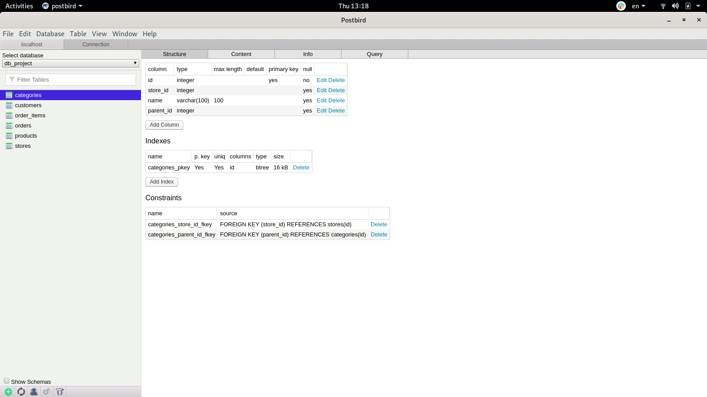
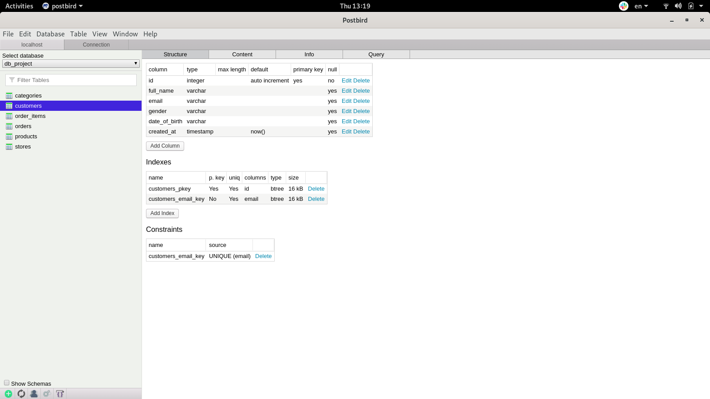
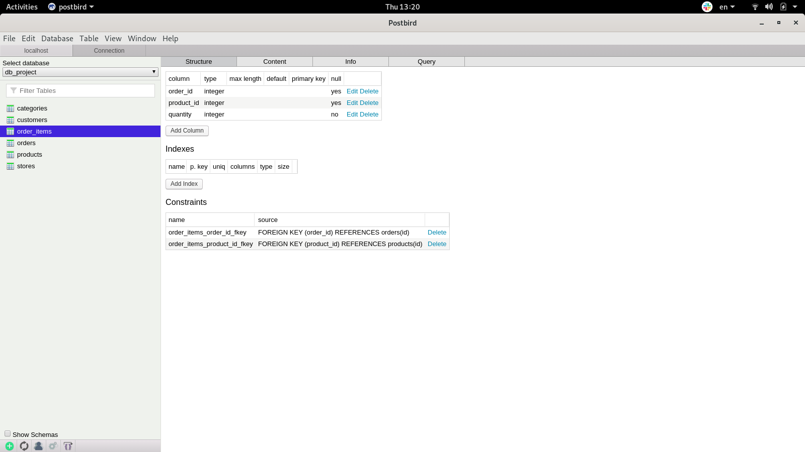
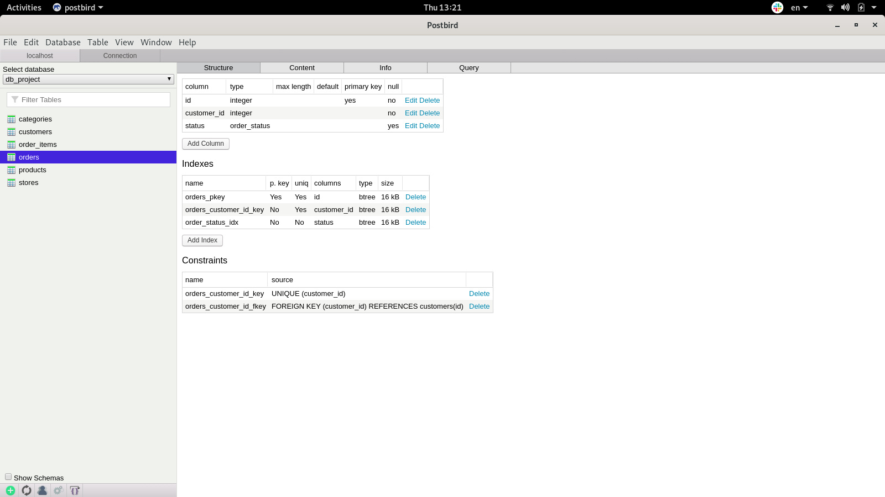
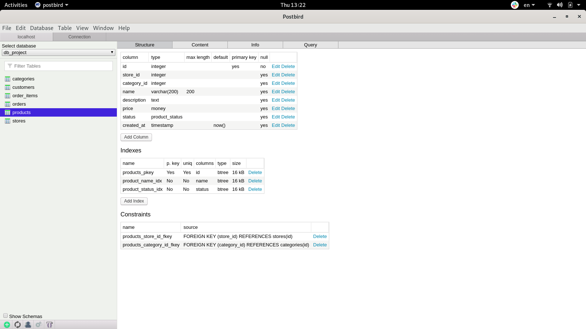
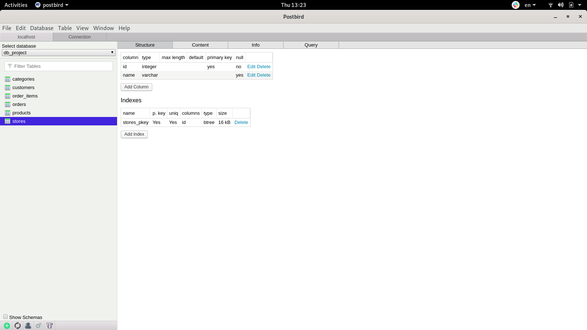

# Create Sample Database with Postgres and Postbird on Linux

## postgres_db_project

1. github repo: `https://github.com/scallopy/postgres_db_project`
2. [How I made my project, my issues and how to fix them](https://docs.google.com/document/d/1p6ubkmZDJ3SS7CMpqIYN5XP9snodKYh5sOyp9wkkaWg/edit#heading=h.5sl4klq4t07j`)

## Project tasks:

1.requirements: PostgreSQL, Postbird

2.Research the topic of your choosing to create a entity relationship diagram for your database

Let's create a database of e-commers.

- Create user to manage database

- Create tables for product, categories and stores with `create_tables.sql`

- Export database: backup1.sql

3.Create the schema of the database using PostgreSQL

- Create db diagram with  [dbdiagram.io](https://dbdiagram.io/home)

4.Save the Diagram as a PDF file: `db_diagram/Copy of Sample Ecommerce.pdf`

5.Export postgres sql file from dbdiagram.io

6.Populate your database with some data: `backup/backup2`.

7.Update your database to ensure your data stays intact. This could include adding constraints and roles

8.Update your database to ensure your database stays fast. This could include adding indexes, normalizing your database, and actively monitoring and maintaining your database:

- `backup/backup3`

## Tables:

